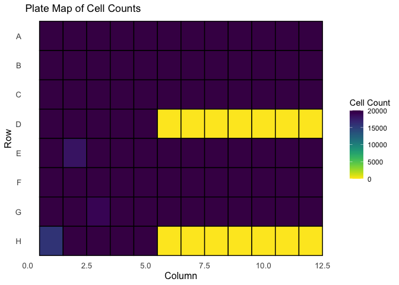
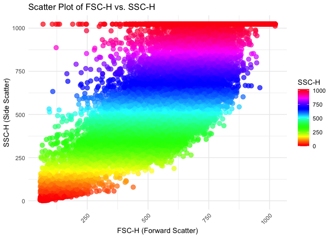
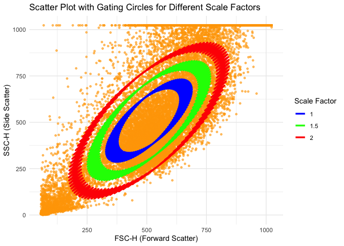
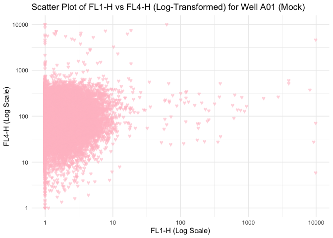
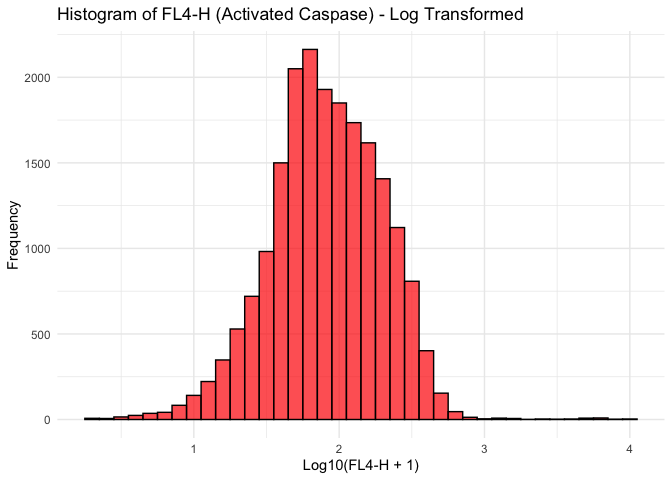
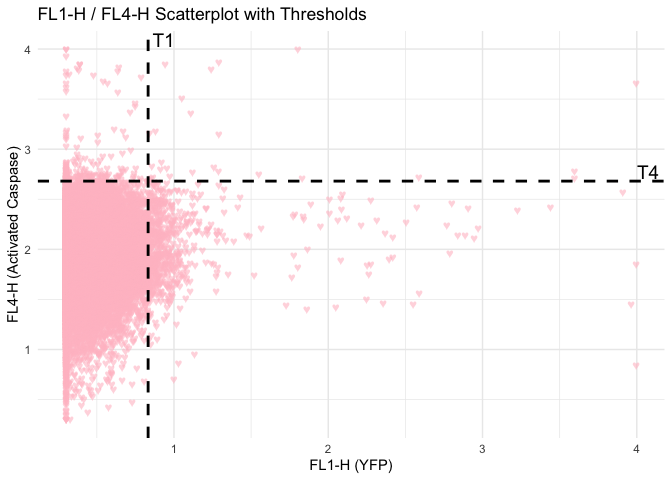
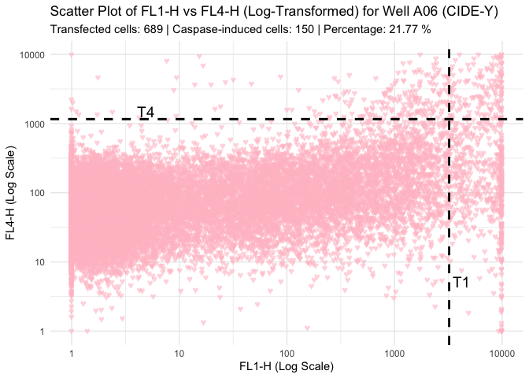

Flow_Cytometry
================
Arjunsinh Harer
2025-01-30

# QUESTION 1

## a.) Load Apoptosis Data

``` r
# apoptosis_path <- "/Users/arjunsinhharer/Desktop/RBIF_112/Week_2/Homework_2/Flow_Cytometry_Data/apoptosis"
# map_path <- "/Users/arjunsinhharer/Desktop/RBIF_112/Week_2/Homework_2/Flow_Cytometry_Data/map"
library(flowCore)

# Define the path to the directory containing the FCS files
sampleDir <- "/Users/arjunsinhharer/Desktop/RBIF_112/Week_2/Homework_2/Flow_Cytometry_Data/apoptosis"

# List all FCS files in the directory
file_list <- list.files(path = sampleDir, pattern = "^test", full.names = TRUE)

# Read all FCS files and add a column for the file name in each dataframe
fcs_data_frames <- lapply(file_list, function(file_path) {
  fcs_data <- read.FCS(file_path)
  fcs_data <- as.data.frame(exprs(fcs_data))
  fcs_data$SourceFile <- basename(file_path)  # Append file name as a new column
  return(fcs_data)
})

# Combine all individual dataframes into one large dataframe
combined_data <- do.call(rbind, fcs_data_frames)

# Check the first few rows to confirm file names are included
head(combined_data)
```

    ##   FSC-H SSC-H      FL1-H     FL2-H     FL3-H FL2-A     FL4-H Time
    ## 1   275   299   2.147985  245.8244  4.572527    50  30.78090    0
    ## 2   560   275   2.996143  147.2207  3.619043    31 205.35250    0
    ## 3    87   156   5.829415  133.3521  2.864384    35 365.17413    0
    ## 4   845   791   1.000000  577.7218 10.366329   142 239.27992    0
    ## 5   552   389   2.502865  232.9097  1.876884    53  37.51619    0
    ## 6   530   426 355.452236 2548.2967 11.652155   661  27.13899    0
    ##       SourceFile
    ## 1 test2933T3.A01
    ## 2 test2933T3.A01
    ## 3 test2933T3.A01
    ## 4 test2933T3.A01
    ## 5 test2933T3.A01
    ## 6 test2933T3.A01

I wanted all the data in the apoptosis directory to be in one
data_frame. I figured having everything in a centralized location would
be good for any downstream analysis. Here is a description of the
combined_data.

**FSC-H (Forward Scatter Height):** Measures the light scatter in the
forward direction as a cell passes through the laser beam. It’s
proportional to the cell size. This parameter is often used to infer the
relative size of cells.

**SSC-H (Side Scatter Height):** Measures light scatter at a 90-degree
angle from the laser beam. This parameter is typically used to assess
the internal complexity or granularity of cells, such as the presence of
granules or the complexity of the cell’s nucleus.

**FL1-H (Fluorescence Height - Channel 1):** Represents the peak height
of fluorescence measured in the first fluorescence channel (FL1). This
fluorescence is generally tied to a specific type of marker or dye that
binds to a particular cellular component or molecule. The exact marker
depends on the experimental design (e.g., FITC - fluorescein
isothiocyanate might be common here).

**FL2-H (Fluorescence Height - Channel 2):** Similar to FL1-H, but for
the second fluorescence channel (FL2). This channel will detect a
different marker or dye, providing information on another cellular
component or molecule (e.g., PE - Phycoerythrin).

**FL3-H (Fluorescence Height - Channel 3)**: This measures the peak
height of fluorescence in the third channel (FL3), indicative of yet
another cellular component, tagged with a distinct fluorochrome.

**FL2-A (Fluorescence Area - Channel 2):** This is the integrated area
under the curve of the fluorescence signal as a cell passes through the
laser beam in the second fluorescence channel. This measurement gives an
overall quantity of the fluorescence emitted from the fluorochrome,
which can be helpful in quantifying the expression level of the target
molecule.

**FL4-H (Fluorescence Height - Channel 4):** This column represents the
peak height of fluorescence in a fourth channel (FL4), targeting another
specific molecule or cellular feature. Each channel corresponds to
different markers, which must be specified based on your labelling
scheme.

**Time:** Indicates the time at which each event (cell passing through
the laser) was recorded. This can be useful for kinetic studies or to
track changes over the duration of the flow cytometry session.

**SourceFile:** The name of the file from which the row of data was
sourced, enabling traceability back to the specific experiment or sample
set.

## b.) Load the cytoset

``` r
library(data.table)

# Define the sample directory path
sampleDir <- "/Users/arjunsinhharer/Desktop/RBIF_112/Week_2/Homework_2/Flow_Cytometry_Data/apoptosis"

# Load the annotation data
annotation <- fread(file.path(sampleDir, "plateIndex.txt"))
```

## c.) Obtain Cell Counts

``` r
library(dplyr)

# Ensure that 'annotation' and 'combined_data' are properly loaded and available

# Count the occurrences of each entry in the 'name' column of 'annotation'
# within the 'SourceFile' column of 'combined_data'
cell_counts <- combined_data %>%
  group_by(SourceFile) %>%
  summarise(CellCount = n(), .groups = 'drop') %>%
  right_join(annotation, by = c("SourceFile" = "name"))  # Ensuring all entries in 'annotation' are included

# View the first few entries of the new dataframe
head(cell_counts)
```

    ## # A tibble: 6 × 4
    ##   SourceFile     CellCount clone    wellnr
    ##   <chr>              <int> <chr>     <int>
    ## 1 test2933T3.A01     20000 Mock          1
    ## 2 test2933T3.A02     20000 CDK2-Y        2
    ## 3 test2933T3.A03     20000 Y-Fas         3
    ## 4 test2933T3.A04     20000 Fas-Y         4
    ## 5 test2933T3.A05     20000 Y-CIDE-3      5
    ## 6 test2933T3.A06     20000 CIDE-3-Y      6

This section of code goes into combined data and essentially counts the
occourence of each cell and maps it to every file in apoptosis. To me
it’s a simple and straightforward way to get these counts. `cell_counts`
is the resulting data-frame that we use to create the well-plate plot in
the next section.

## d.) Create the PlatePlot Of Cell Counts

``` r
#Load necessary libraries
library(platetools)
library(dplyr)

# Step 1: Format the Well Names and Prepare Data
# Assuming cell_counts is already loaded and contains 'SourceFile' and 'CellCount'
all_wells <- expand.grid(Row = LETTERS[1:8], Column = 1:12)
all_wells$well <- paste0(all_wells$Row, sprintf("%02d", all_wells$Column))

# Prepare the cell_counts data
cell_counts$well <- sub(".*\\.", "", cell_counts$SourceFile) # Extract well part from SourceFile

# Merge your data with the full set of wells to include all possible wells
complete_data <- merge(all_wells, cell_counts, by = "well", all.x = TRUE)
complete_data$CellCount[is.na(complete_data$CellCount)] <- 0  # Fill missing CellCounts with 0

# Step 2: Use platePlot to create the plate plot directly
# Ensure that complete_data has 'well' and 'CellCount' properly formatted
plate_data <- complete_data[, c("well", "CellCount")]

# Use platePlot to visualize the data
z_map(plate_data$CellCount, well = plate_data$well)
```

<!-- -->

``` r
library(ggplot2)

# Step 1: Format the Well Names and Prepare Data
all_wells <- expand.grid(Row = LETTERS[1:8], Column = 1:12)
all_wells$well <- paste0(all_wells$Row, sprintf("%02d", all_wells$Column))

# Prepare the cell_counts data
cell_counts$well <- sub(".*\\.", "", cell_counts$SourceFile)  # Extract well part from SourceFile

# Merge your data with the full set of wells to include all possible wells
complete_data <- merge(all_wells, cell_counts, by = "well", all.x = TRUE)
complete_data$CellCount[is.na(complete_data$CellCount)] <- 0  # Fill missing CellCounts with 0

# Step 2: Visualize the data using ggplot2
ggplot(complete_data, aes(x = Column, y = Row, fill = CellCount)) +
  geom_tile(color = "black", size = 0.5) +  # Add gridlines
  scale_fill_gradientn(colors = viridis::viridis(100, direction = -1)) +  # Reverse color scale
  scale_y_discrete(limits = rev(levels(all_wells$Row))) +  # Reverse row order for correct plate orientation
  labs(title = "Plate Map of Cell Counts",
       x = "Column",
       y = "Row",
       fill = "Cell Count") +  # Add legend for Cell Count
  theme_minimal() +
  theme(panel.grid = element_blank(),
        axis.text = element_text(size = 10),
        axis.title = element_text(size = 12))
```

<!-- -->

Overall almost every well has 20,000 cells, the color-bar is flipped
please ignore it. The darker wells don’t have any cells and the light
blue are the ones that do have cells. I made a back-up plot that
displays this information correctly. I could not get the platetools
library to flip the color scale. I did this to show that my analysis is
sound, but the platetools documentation does not provide guidance on how
to fix this.

# QUESTION 2

## a.) FSC-H x SSC-H Scatter Plot

This script shows a scatter plot of FSC-H SSC-H values for well A01, but
one can modify the script to get the scatterplot for any well. Ideally
I’d like to make an animated video that shows a scatterplot for each
well by plotting in a loop. But that’s beyond the scope of the
assignment so I won’t do it.

``` r
# Load necessary library
library(ggplot2)

# Filter data for the specific well, for example 'test2933T3.A01'
specific_well_data <- combined_data[combined_data$SourceFile == "test2933T3.A01", ]

# Ensure no NA values in the columns to be plotted
specific_well_data <- specific_well_data[complete.cases(specific_well_data[, c('FSC-H', 'SSC-H')]),]

# Create a scatter plot of FSC-H vs. SSC-H
plot <- ggplot(specific_well_data, aes(x = `FSC-H`, y = `SSC-H`)) +
  geom_point(aes(color = `SSC-H`), alpha = 0.7, size = 3) +  # Color points by SSC-H
  scale_color_gradientn(colors = rainbow(100)) +  # Use a rainbow gradient for coloring
  labs(title = "Scatter Plot of FSC-H vs. SSC-H",
       x = "FSC-H (Forward Scatter)",
       y = "SSC-H (Side Scatter)") +
  theme_minimal() +
  theme(axis.text.x = element_text(angle = 45, hjust = 1))  # Enhance readability of x-axis labels

# Print the plot
print(plot)
```

<!-- -->

1.  **Axis Information**:
    - **FSC-H (X-axis)**: Forward Scatter Height (FSC-H) primarily
      indicates the cell size. Larger values on the FSC-H axis suggest
      larger cells.
    - **SSC-H (Y-axis)**: Side Scatter Height (SSC-H) reflects the
      granularity or complexity of the cells. Higher values on the SSC-H
      axis suggest more granular or complex cells.
2.  **Color Gradient (Legend)**:
    - The legend shows a color gradient linked to the SSC-H values,
      ranging from low to high. The colors transition from blue (low
      SSC-H values) to red (high SSC-H values).
    - This color coding helps in quickly visualizing which cells are
      larger and more complex or granular. For instance, cells in the
      red zone are not only likely larger but also more complex, as
      indicated by their higher SSC-H values.
3.  **Distribution Pattern**:
    - The plot shows a dense clustering of points toward the bottom left
      (smaller, less complex cells) gradually spreading out towards the
      top right (larger, more complex cells).
    - The dispersion pattern could indicate a variety of cell types
      within the sample, with distinct physical characteristics.
4.  **Plot Interpretation**: Cells with higher granularity (like
    granulocytes) will appear higher on the SSC-H axis, while larger
    cells (like some tumor cells) will be further along the FSC-H axis.
    - The plot can be used to set gates for sorting or analyzing
      subpopulations of cells, which is a common practice in
      immunological studies or cancer research.

## b.) Finding the main cell population

``` r
# Define the generate_ellipse function
generate_ellipse <- function(center, cov_matrix, radius, n_points = 200) {
  angles <- seq(0, 2 * pi, length.out = n_points)
  eigen_values <- eigen(cov_matrix)
  transformation_matrix <- eigen_values$vectors %*% diag(sqrt(eigen_values$values))
  ellipse <- t(radius * transformation_matrix %*% rbind(cos(angles), sin(angles))) + center
  data.frame(ellipse)
}
```

The generate_ellipse function computes the points of an ellipse based on
the covariance matrix and the center derived from the norm2Filter. It
ensures that the gating circles plotted are mathematically derived from
the data rather than being arbitrarily drawn.

``` r
library(flowCore)
library(flowStats)
library(ggplot2)

# Load the .fcs file
file_path <- "/Users/arjunsinhharer/Desktop/RBIF_112/Week_2/Homework_2/Flow_Cytometry_Data/apoptosis/test2933T3.A01"
ff <- read.FCS(file_path)

# Define scale factors to test
scale_factors <- c(1, 1.5, 2)

# Extract base filter parameters
nfit <- norm2Filter("SSC-H", "FSC-H", scale = 1, filterId = "Selected")
fres <- flowCore::filter(ff, nfit)
center <- attributes(fres@subSet)$center
cov_matrix <- attributes(fres@subSet)$cov

# Generate gating ellipses for each scale factor
ellipse_list <- lapply(scale_factors, function(scale) {
  radius <- scale * attributes(fres@subSet)$radius
  ellipse_points <- generate_ellipse(center, cov_matrix, radius)
  ellipse_points$scale <- scale  # Add scale info for labeling
  ellipse_points
})

# Combine all ellipses into one data frame
ellipse_data <- do.call(rbind, ellipse_list)
colnames(ellipse_data)[1:2] <- c("SSC-H", "FSC-H")

# Convert flowFrame to data frame for plotting
ff_data <- as.data.frame(exprs(ff))

# Plot the data and overlay gates for all scale factors
ggplot(ff_data, aes(x = `FSC-H`, y = `SSC-H`)) +
  geom_point(color = "orange", alpha = 0.6, size = 1) +  # Set scatterplot points to orange
  geom_path(data = ellipse_data, aes(x = `FSC-H`, y = `SSC-H`, color = factor(scale)),
            size = 1.2) +
  scale_color_manual(values = c("blue", "green", "red"), name = "Scale Factor") +
  labs(title = "Scatter Plot with Gating Circles for Different Scale Factors",
       x = "FSC-H (Forward Scatter)",
       y = "SSC-H (Side Scatter)") +
  theme_minimal()
```

<!-- -->

``` r
# List all objects in the environment
all_objects <- ls()

# Specify the datasets to keep
datasets_to_keep <- c("combined_data", "complete_data")

# Remove all objects except for those specified in datasets_to_keep
rm(list = all_objects[!all_objects %in% datasets_to_keep])
```

In this analysis, the gating ellipses overlaid on the scatter plot are
derived directly from the data using statistical methods provided by the
`flowStats` library. Specifically, I used the `norm2Filter` function to
create a two-dimensional gating filter based on the distribution of
`FSC-H` and `SSC-H`. This filter calculates the center and covariance
matrix of the data, which define the location and shape of the gating
region. The gates are represented as ellipses in Mahalanobis distance
space, ensuring they reflect the statistical properties of the data
rather than arbitrary boundaries. I applied scale factors of 1, 1.5, and
2 to adjust the radius of the ellipses, allowing me to explore how the
gating region changes and how it impacts the points included. These
gates, overlaid on the scatter plot, provide a data-driven visualization
of the population, demonstrating how the filtering procedure informs the
gating process.

This simple gating procedure appears to work well in identifying the
main population of interest while excluding outliers and irrelevant data
points. The data-driven nature of the `norm2Filter` ensures that the
gates are statistically meaningful and align with the underlying data
distribution. The choice of scale factors allows flexibility in defining
the stringency of the gating, with smaller scale factors providing
tighter boundaries and larger scale factors capturing more variability
in the data. However, the procedure is limited by its assumption of
normality and reliance on the covariance structure, which may not always
capture complex or multimodal distributions present in biological data.
In this case, the ellipses seem to capture the central population
effectively, but I would remain cautious when interpreting results near
the boundaries, as overlapping distributions or heterogeneous
subpopulations could affect accuracy. While the approach is useful for
exploratory analysis, I would validate the gates against additional
biological or experimental criteria before relying on them for
definitive conclusions.

# QUESTION 3

## a1.) Scatter-Plot of FL1-H/FL4-H for Mock-Well A01

``` r
library(ggplot2)

# Filter the data for Well A01 (Mock) from the combined_data dataframe
well_a01_data <- combined_data[grepl("A01", combined_data$SourceFile), ]

# Ensure there are no NA or zero values in the columns to be plotted (log transformation requires positive values)
well_a01_data <- well_a01_data[complete.cases(well_a01_data[, c("FL1-H", "FL4-H")]) & 
                                 well_a01_data$`FL1-H` > 0 & well_a01_data$`FL4-H` > 0, ]

# Create the scatterplot with log-transformed axes
plot <- ggplot(well_a01_data, aes(x = `FL1-H`, y = `FL4-H`)) +
  geom_point(color = "pink", alpha = 0.6, size = 3, shape = "\u2665") +  # Set scatterplot points to orange
  scale_x_log10() +  # Log-transform the x-axis
  scale_y_log10() +  # Log-transform the y-axis
  labs(title = "Scatter Plot of FL1-H vs FL4-H (Log-Transformed) for Well A01 (Mock)",
       x = "FL1-H (Log Scale)",
       y = "FL4-H (Log Scale)") +
  theme_minimal()

# Print the plot
print(plot)
```

<!-- -->

Log transformation is often applied to fluorescence data, especially
when analyzing flow cytometry data. Fluorescence signals from flow
cytometry are often distributed logarithmically because the data spans
several orders of magnitude (e.g., low autofluorescence to high
expression). A log transformation rescales the data, making it easier to
visualize differences across such a wide range.

Without a log transformation, low fluorescence signals can be compressed
into a narrow range of values, making it difficult to distinguish
background or small variations. Log transformation expands this range
for better visualization.Fluorescence data is typically right-skewed.
Log transformation reduces this skewness, making distributions more
symmetrical and easier to interpret.

Many flow cytometry instruments and software default to log-transformed
data because it aligns better with how fluorescence is interpreted in
practice. By applying a log transformation, the histograms for FL1-H
(YFP) and FL4-H (activated caspase) show both low and high fluorescence
intensities on the same scale.

The majority of the points are concentrated in the lower left region,
indicating low intensity for both FL1-H and FL4-H channels. This is
expected for the mock control, as it represents cells transfected with
an empty vector, and we do not anticipate either YFP expression or
caspase activation in these cells. A small number of points deviate from
the main population, particularly along the x-axis (FL1-H) and y-axis
(FL4-H). These likely represent background noise, rare events, or
stochastic variations in the fluorescence signals. The distribution
reflects the baseline fluorescence levels of the mock control, with
minimal signal in both channels.

## a2.) FL1-H & FL4-H Histograms

``` r
library(ggplot2)

# Filter data for the mock control well (e.g., "A01")
mock_control_data <- combined_data[grep("A01", combined_data$SourceFile), ]

# Log-transform the FL1-H and FL4-H values to avoid log(0) issues
mock_control_data$`FL1-H` <- log10(mock_control_data$`FL1-H` + 1)
mock_control_data$`FL4-H` <- log10(mock_control_data$`FL4-H` + 1)

# Create a histogram for FL1-H (YFP)
histogram_FL1H <- ggplot(mock_control_data, aes(x = `FL1-H`)) +
  geom_histogram(binwidth = 0.1, fill = "blue", color = "black", alpha = 0.7) +
  labs(title = "Histogram of FL1-H (YFP) - Log Transformed",
       x = "Log10(FL1-H + 1)",
       y = "Frequency") +
  theme_minimal()

# Create a histogram for FL4-H (Activated Caspase)
histogram_FL4H <- ggplot(mock_control_data, aes(x = `FL4-H`)) +
  geom_histogram(binwidth = 0.1, fill = "red", color = "black", alpha = 0.7) +
  labs(title = "Histogram of FL4-H (Activated Caspase) - Log Transformed",
       x = "Log10(FL4-H + 1)",
       y = "Frequency") +
  theme_minimal()

# Print the histograms
print(histogram_FL1H)
```

<!-- -->

``` r
print(histogram_FL4H)
```

<!-- -->

## b.) Calculating FL1-H & FL4-H Threshold Values T1 & T4

``` r
# Define a helper function to calculate thresholds
calculate_thresholds <- function(data, x_col, y_col) {
  # Calculate mean and standard deviation for the x-axis column
  mean_x <- mean(data[[x_col]], na.rm = TRUE)
  sd_x <- sd(data[[x_col]], na.rm = TRUE)
  T_x <- mean_x + 2 * sd_x
  
  # Calculate mean and standard deviation for the y-axis column
  mean_y <- mean(data[[y_col]], na.rm = TRUE)
  sd_y <- sd(data[[y_col]], na.rm = TRUE)
  T_y <- mean_y + 2 * sd_y
  
  # Return thresholds as a named list
  list(T_x = T_x, T_y = T_y)
}

# Example usage on mock control
thresholds <- calculate_thresholds(
  data = mock_control_data,
  x_col = "FL1-H",
  y_col = "FL4-H"
)

# Print the thresholds
cat("Threshold T1 (FL1-H):", thresholds$T_x, "\n")
```

    ## Threshold T1 (FL1-H): 0.8323683

``` r
cat("Threshold T4 (FL4-H):", thresholds$T_y, "\n")
```

    ## Threshold T4 (FL4-H): 2.681224

I created a function to calculate thresholds for any well. I calculated
$T_1$ and $T_4$ as statistical thresholds to identify elevated signals
in the **FL1-H (YFP)** and **FL4-H (activated caspase)** channels,
respectively. These thresholds were determined as the mean intensity
plus two standard deviations from the mock control, ensuring they
reflect significant deviations from baseline fluorescence. $T_1$
indicates cells with YFP expression above the mock control baseline,
while $T_4$ identifies cells with elevated caspase activity. Using these
thresholds, I divided the scatterplot into four regions to distinguish
cells with no activity or expression, elevated YFP or caspase activity
alone, and cells exhibiting both signals.

**Function Parameters:**

data: The input data frame for a specific well. x_col: The name of the
column for the x-axis (e.g., FL1-H). y_col: The name of the column for
the y-axis (e.g., FL4-H).

**Return Value:**

A named list containing the thresholds T1 and T4

## c.) FL1-H/FL4-H Scatterplot with Thresholds

``` r
library(ggplot2)

# Calculate thresholds for FL1-H and FL4-H
mean_FL1H <- mean(mock_control_data$`FL1-H`)
sd_FL1H <- sd(mock_control_data$`FL1-H`)
T1 <- mean_FL1H + 2 * sd_FL1H

mean_FL4H <- mean(mock_control_data$`FL4-H`)
sd_FL4H <- sd(mock_control_data$`FL4-H`)
T4 <- mean_FL4H + 2 * sd_FL4H

# Re-plot the FL1-H / FL4-H scatterplot with thresholds
scatterplot_with_thresholds <- ggplot(mock_control_data, aes(x = `FL1-H`, y = `FL4-H`)) +
  geom_point(color = "pink", alpha = 0.6, size = 3, shape = "\u2665") +  # Scatterplot points
  geom_vline(xintercept = T1, color = "black", linetype = "dashed", size = 1) +  # Vertical threshold (T1)
  geom_hline(yintercept = T4, color = "black", linetype = "dashed", size = 1) +  # Horizontal threshold (T4)
  
  annotate("text", x = T1, y = max(mock_control_data$`FL4-H`), label = "T1", 
           hjust = -0.2, vjust = -0.2, color = "black", size = 5) +  # Label for T1
  annotate("text", x = max(mock_control_data$`FL1-H`), y = T4, label = "T4", 
           hjust = -0.05, vjust = -0.2, color = "black", size = 5) +  # Label for T4
  
  labs(title = "FL1-H / FL4-H Scatterplot with Thresholds",
       x = "FL1-H (YFP)",
       y = "FL4-H (Activated Caspase)") +
  theme_minimal()

# Print the scatterplot
print(scatterplot_with_thresholds)
```

<!-- -->

The thresholds T1 and T4 allow us to identify cells with biologically
meaningful levels of YFP expression or caspase activation,
distinguishing them from random fluctuations or baseline noise. Using
the mock control ensures the thresholds are tailored to the system’s
inherent variability and noise level. When plotted on the scatterplot,
these thresholds divide the data into four regions.

**Bottom-left** (no YFP, no activity): Cells with both FL1-H and FL4-H
intensities below their respective thresholds. **Top-right** (YFP +
activated caspase): Cells with both FL1-H and FL4-H intensities above
their respective thresholds. **Top-left** (no YFP, elevated caspase):
Cells with FL4-H intensity above T4, but FL1-H intensity below T4 .
**Bottom-right** (YFP, no activity): Cells with FL1-H intensity above
T1, but FL4-H intensity below T4

## d.) FL1-H/FL4-H Scatterplots in A06 with Thresholds

``` r
# Filter the data for Well A06 (CIDE-Y) from the combined_data dataframe
well_a06_data <- combined_data[grepl("A06", combined_data$SourceFile), ]

# Ensure there are no NA or zero values in the columns to be plotted (log transformation requires positive values)
well_a06_data <- well_a06_data[complete.cases(well_a06_data[, c("FL1-H", "FL4-H")]) & 
                                 well_a06_data$`FL1-H` > 0 & well_a06_data$`FL4-H` > 0, ]

# Use the helper function to calculate thresholds
thresholds <- calculate_thresholds(well_a06_data, x_col = "FL1-H", y_col = "FL4-H")

# Extract the thresholds
T1 <- thresholds$T_x
T4 <- thresholds$T_y

# Calculate percentages
transfected_cells <- sum(well_a06_data$`FL1-H` > T1)
caspase_induced_cells <- sum(well_a06_data$`FL1-H` > T1 & well_a06_data$`FL4-H` > T4)
percentage <- (caspase_induced_cells / transfected_cells) * 100

# Print the thresholds and percentages
cat("Threshold T1 (FL1-H):", T1, "\n")
```

    ## Threshold T1 (FL1-H): 3218.187

``` r
cat("Threshold T4 (FL4-H):", T4, "\n")
```

    ## Threshold T4 (FL4-H): 1158.718

``` r
cat("Percentage of caspase-induced cells among transfected cells:", percentage, "%\n")
```

    ## Percentage of caspase-induced cells among transfected cells: 21.77068 %

``` r
# Create the scatterplot with log-transformed axes and overlay thresholds
plot <- ggplot(well_a06_data, aes(x = `FL1-H`, y = `FL4-H`)) +
  geom_point(color = "pink", alpha = 0.6, size = 3, shape = "\u2665") +  # Set scatterplot points to orange
  scale_x_log10() +  # Log-transform the x-axis
  scale_y_log10() +  # Log-transform the y-axis
  geom_vline(xintercept = T1, color = "black", linetype = "dashed", size = 1) +  # Vertical threshold line for T1
  geom_hline(yintercept = T4, color = "black", linetype = "dashed", size = 1) +  # Horizontal threshold line for T4
    annotate("text", x = T1, y = max(mock_control_data$`FL4-H`), label = "T1", 
           hjust = -0.2, vjust = -0.2, color = "black", size = 5) +  # Label for T1
  annotate("text", x = max(mock_control_data$`FL1-H`), y = T4, label = "T4", 
           hjust = -0.05, vjust = -0.2, color = "black", size = 5) +  # Label for T4
  
  labs(title = "Scatter Plot of FL1-H vs FL4-H (Log-Transformed) for Well A06 (CIDE-Y)",
       subtitle = paste("Transfected cells:", transfected_cells, 
                        "| Caspase-induced cells:", caspase_induced_cells, 
                        "| Percentage:", round(percentage, 2), "%"),
       x = "FL1-H (Log Scale)",
       y = "FL4-H (Log Scale)") +
  theme_minimal()

# Print the plot
print(plot)
```

<!-- -->

This plot shows the relationship between FL1-H (YFP expression) and
FL4-H (caspase activation) intensities for Well A06 (CIDE-Y), with both
axes log-transformed for better visualization. I set thresholds T1 (for
FL1-H) and T4 (for FL4-H) to identify biologically meaningful levels of
YFP expression and caspase activation. The vertical line represents T1,
identifying YFP-positive cells, and the horizontal line represents T4,
identifying caspase-positive cells. The plot is divided into four
regions: the bottom-left quadrant contains cells with no YFP expression
and no caspase activation, the top-right quadrant contains cells that
are both YFP-positive and caspase-positive, the bottom-right quadrant
contains YFP-positive cells with no caspase activation, and the top-left
quadrant contains cells with caspase activation but no YFP expression. I
calculated that 689 cells are transfected (FL1-H \> T1) and 150 cells
are caspase-induced (FL1-H \> T1 and FL4-H \> T4), resulting in 21.77%
of transfected cells showing caspase activation. This finding aligns
with the role of CIDE-Y as an apoptosis activator and highlights its
ability to induce caspase activity in a significant fraction of
YFP-positive cells.

## R Markdown

This is an R Markdown document. Markdown is a simple formatting syntax
for authoring HTML, PDF, and MS Word documents. For more details on
using R Markdown see <http://rmarkdown.rstudio.com>.

When you click the **Knit** button a document will be generated that
includes both content as well as the output of any embedded R code
chunks within the document. You can embed an R code chunk like this:

``` r
summary(cars)
```

    ##      speed           dist       
    ##  Min.   : 4.0   Min.   :  2.00  
    ##  1st Qu.:12.0   1st Qu.: 26.00  
    ##  Median :15.0   Median : 36.00  
    ##  Mean   :15.4   Mean   : 42.98  
    ##  3rd Qu.:19.0   3rd Qu.: 56.00  
    ##  Max.   :25.0   Max.   :120.00

## Including Plots

You can also embed plots, for example:

<!-- -->

Note that the `echo = FALSE` parameter was added to the code chunk to
prevent printing of the R code that generated the plot.
